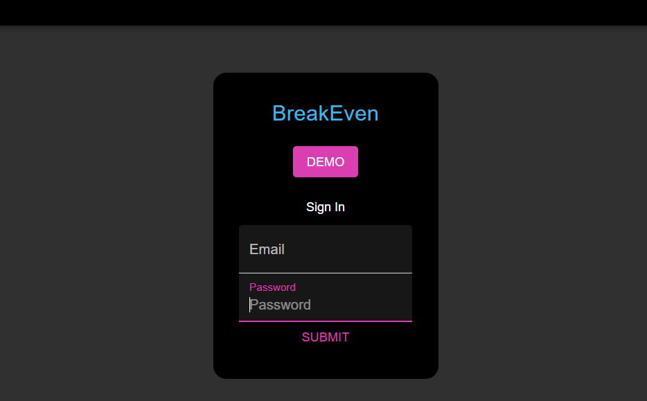
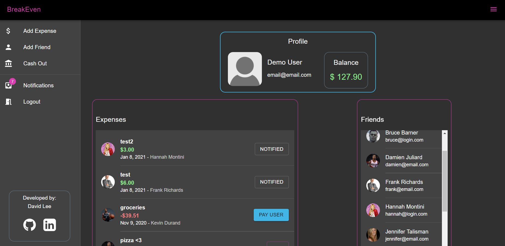
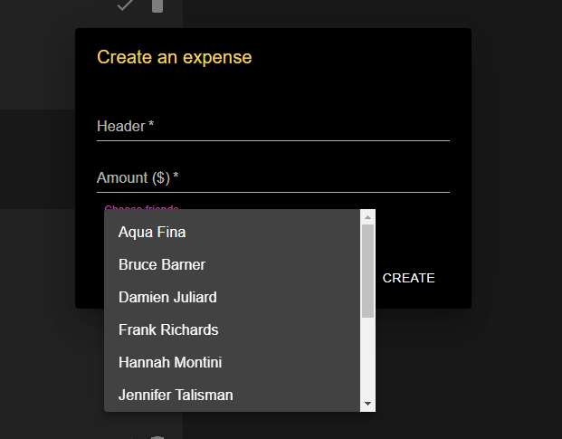
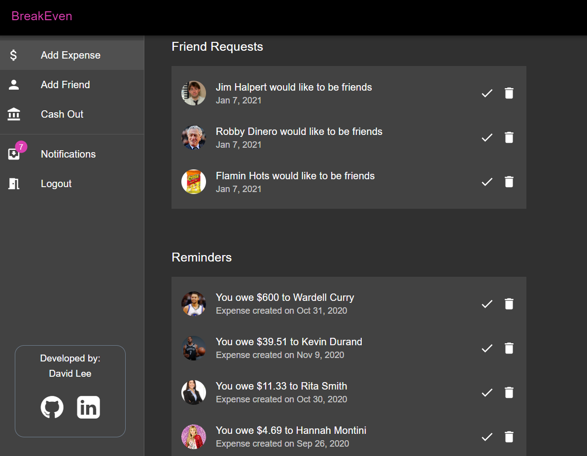

## Technologies:
JavaScript, Express.js, Node.js, React.js, Redux, Sequelize, Postgres, HTML & CSS

---

# BreakEven
## Expense-tracking application

**Developer:**
David Lee

**Table of Contents**

[About](#about-breakeven) | [Features](#features) | [Installation](#installation) | [Contact](#contact)

## About BreakEven

An expense-tracking application that allow users to record their financial data and personal expenses by creating new expenses, paying off past expenses, and request payments from other users. Users can 'friend' other users, cash out their balance, and notify their friends of unpaid expenses

**Github Backend URL**
* https://github.com/dyclee/breakeven-backend

## Features

* Users can pay expenses requested from friends
* Users can notify their friends associated with unpaid expenses

 

---

* Users can create expenses associated with any number of friends

---

* Users can make friend requests and accept incoming requests
* Users can cash out their current balance (only if balance is positive)
